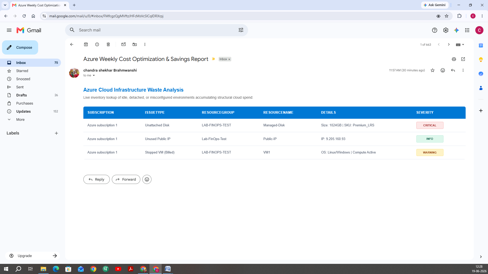

markdown# 💰 Azure Cost Optimization & Savings Scanner

An automated, 100% serverless PowerShell engine designed to natively scan Azure subscriptions, identify active billing waste, and compile presentation-ready HTML cost-audit report dashboards directly to your inbox.

---

## 🚀 Key Technical Features
- **Unattached Disks Scan Matrix:** Automatically tracks down detached, orphaned managed storage volumes bleeding money without active compute bindings.
- **Multi-OS Stopped Instance Auditor:** Cross-queries lazy-loaded Azure runtime arrays to pinpoint Windows/Linux VMs sitting in a "Stopped" (Allocated/Billed) state instead of Deallocated.
- **Orphaned Public IPs Detector:** Highlights loose, disassociated network public IP allocations charging ongoing standard preservation fees.
- **Enterprise Notification Automation:** Natively interfaces via serverless workflows to dispatch beautiful, styled HTML data matrices straight to stakeholders' Outlook inboxes.

---

## 📊 Sample Report Dashboard Layout
*Below is a structural preview of the automated weekly report delivered to stakeholders:*

| Issue Type | Resource Group | Resource Name | Details / Specifications | Severity Status |
| :--- | :--- | :--- | :--- | :--- |
| **Unattached Disk** | rg-production-vms | prod-db-disk-02 | Size: 128GB | SKU: Premium_LRS | 🔴 High |
| **Stopped VM (Billed)** | rg-testing-environment | dev-linux-node01 | OS: Linux | Compute allocated but idle | 🟠 Medium |
| **Unused Public IP** | rg-networking-prod | web-alb-public-ip | IP Routing Target: 40.85.xx.xx | 🟢 Low |

---

## 🔒 Enterprise Safety & Data Compliance (Client Peace of Mind)
- **100% Read-Only Scope:** The engine strictly leverages standard `Get-Az*` commands. It possesses **zero deletion or mutation capabilities**, ensuring absolute safety for live production environments.
- **Enforced Least Privilege Model:** Operates perfectly under the native Microsoft **Reader** RBAC role context. No Global Admin or Subscription Owner permissions required.
- **100% Strict Data Privacy:** Completely self-contained and local. Your cloud topology infrastructure and billing data never leave your secure Azure tenant boundary layer.

---

## ⚙️ How to Deploy This Framework
To run this tool natively without complex scripts templates engine validation errors, you can deploy using our validated **Standard Operating Procedure (SOP)**.

- **Option A (Done-For-You):** I can jump on a brief 10-minute discovery call to set up the automation pipelines live on screen share.
- **Option B (Self-Service Handover):** I provide a highly detailed, non-technical, click-by-click **Enterprise Deployment Manual (SOP Guide)** so your internal system administrator can completely stand up the solution in under 5 minutes without giving me any external access tokens.

---

## 💼 Looking to Optimize Your Corporate Azure Bill?
I am a specialized Cloud FinOps Consultant. If your engineering layers are bleeding credit quotas or you want to shave **20% to 40%** off your monthly Azure statements safely, let's align!

- **Hire me on Upwork:** [Insert Your Upwork Profile URL Link Here]
- **Connect on LinkedIn:** [Insert Your LinkedIn Profile URL Link Here]
- **Business Email:** `your.email@domain.com`
